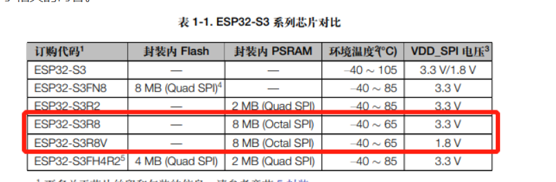

# 修改pin

# 修改psram

大于8M的psram为8线spi

``` bash
menuconfig->Component config ->ESP PSRAM->Support of external,SPI-connected RAM
menuconfig->Component config ->ESP PSRAM->SPI RAM config->
Mode (QUAD/OCT) of SPI RAM chip in use (Octal Mode PSRAM)->Octal Mode PSRAM
```



# 注释掉gap

``` c
esp_lcd_panel_set_gap(panel_handle, 0, 20);
```

# 查看是否颜色反转

RGB和BGR

``` c
 esp_lcd_panel_dev_config_t panel_config = {
        .reset_gpio_num = EXAMPLE_PIN_NUM_RST,
        .rgb_endian = LCD_RGB_ENDIAN_BGR, // <------------
        .bits_per_pixel = 16,
    };
```

# 显示调整方向

## 1. xy方向互换

``` c
esp_lcd_panel_swap_xy(panel_handle, true);
```

## 2. x镜像 / y镜像

``` c
esp_lcd_panel_mirror(panel_handle, true, false);

```

# 触摸调整方向

## 1. xy方向互换
## 2. x镜像 / y镜像

``` c
esp_lcd_touch_config_t tp_cfg = {
        .x_max = EXAMPLE_LCD_V_RES,
        .y_max = EXAMPLE_LCD_H_RES,
        .rst_gpio_num = -1,
        .int_gpio_num = -1,
        .flags = {
            .swap_xy = 0,
            .mirror_x = 0,
            .mirror_y = 0,
        },
    };
```

# 提高刷屏周期(FPS)

默认的项目是100ms 刷新一次屏幕最大10fps

``` c
idf.py menuconfig

(Top) → Component config → LVGL configuration → HAL Settings
                                                  Espressif IoT Development Framework Configuration
(10) Default display refresh period (ms).   // FPS刷新率
(30) Input device read period [ms].         // 输入刷新率
[ ] Use a custom tick source                
(50) Default Dots Per Inch (in px).         // 每英寸 像素点 数量
```
